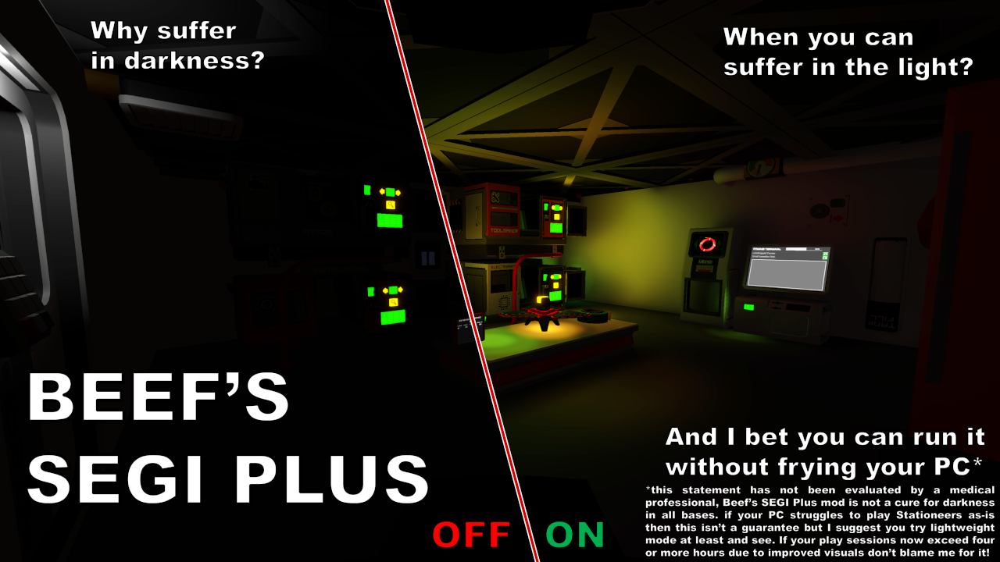

# Beef's SEGI Plus

There is an in-game config menu with F11.

A modified version of SEGI (Sonic Ether Global Illumination) for Stationeers with shader fixes and performance options.

## Features

- 4 quality presets (Low/Medium/High/Extreme)
- Lightweight Mode that voxelizes only emissive objects for maximum performance at the cost of more light leakage
- This lightweight mode is independent from the quality preset, so can be enabled/disabled to find the best balance for you
- Automatic day/night ambient lighting that adjusts based on sun position
- Modified SEGI shaders to work properly with Stationeers rendering
- In-game configuration menu (Press F11 while in-game)
- In addition to lightweight mode, has an adaptive performance mode with strategy and target framerate options

## Requirements

**WARNING:** This is a StationeersLaunchPad Plugin Mod. It requires BepInEx to be installed with the StationeersLaunchPad plugin.

See: [https://github.com/StationeersLaunchPad/StationeersLaunchPad](https://github.com/StationeersLaunchPad/StationeersLaunchPad)

## Installation

1. Ensure you have BepInEx and StationeersLaunchPad installed.
2. Install from the Steam Workshop, or manually place the DLL file into your `/BepInEx/plugins/` folder.

## Usage

Configuration available through F11 in-game menu, StationeersLaunchPad config, or BepInEx config files.

## Credits

Built upon the work of:
- **Sonic Ether** (original SEGI): [https://github.com/sonicether/SEGI](https://github.com/sonicether/SEGI)
- **Erdroy** (initial Stationeers port): [https://github.com/Erdroy/Stationeers.SEGI](https://github.com/Erdroy/Stationeers.SEGI)
- **Vinus** (previous implementation): [https://github.com/TerameTechYT/StationeersSharp/tree/development/Source/SEGIMod](https://github.com/TerameTechYT/StationeersSharp/tree/development/Source/SEGIMod)

## Changelog

>### Version 1.2.2:
>- Another pass on adaptive performance
>- Only two strategies now: Balanced and Reduce Distance first
>- Added min distance option for reduce distance first
>- Properly handle when desired framerate is set above in-game framerate limiter

>### Version 1.2.2:
> - Shrunk F11 menu slightly
> - Added color backgrounds to each section to improve understanding of grouping as it's getting crowded
> - Added Adaptive Strategy option to adjust what's prioritized in adaptive performance mode
> - Added long-term accumulator for adaptive to bump quality up slightly when framerate stays stable but slightly below target

>### Version 1.2.1:
> - Widened adaptive framerate slider choices
> - Automatically remove/mark read the major update popup if go into world
> - Added an x10 multiplier option if you want to play around with silly gain values
> - Darkened background of F11 menu slightly

>### Version 1.2.0:
> - Added first pass of adaptive framerate control that works with the quality setting to try and improve performance
> - This can be used at any quality setting and with or without lightweight mode
> - This isn't automatically enabled as it's yet experimental - you can enable this in settings

>### Version 1.1.1
> - Improved lightweight mode cleanup
> - I inverted the new sun calc like a big dumb

>### Version 1.1.0
>- Added more info to the F11 menu to help with understanding settings
>- Fixed F11 menu breaking when returning or used in main menu/splash screens
>- Added F11 menu scaling so it is bigger at 1440/4k
>- Better day/night transition (now transitions between 2-10 degrees sun elevation instead of +5/-5 deg)
>- Added Advanced Furnace to object exclusion list in lightweight mode
>- Thanks **BassManDan** for your feedback helping get this update done quickly 

>### Version 1.0.0
>- Updated plugin architecture for current Stationeers version
>- Added lightweight rendering with cached object culling
>- Implemented quality preset system
>- Improved scene management and layer culling
>- Day/night diffuse light adjustments
>- Updated SEGI shaders for Stationeers compatibility

## Roadmap
- [ ] add more text explanations if needed
- [ ] see if i can cull out the interaction boxes because these are annoying when they glow
- [ ] check sensor lenses/nvgs/etc and see if there's anything there to cull too
- [ ] find what other items need to be culled in lightweight mode since they're giant beacons of light

## Source Code

The source code is available on GitHub:
[https://github.com/TheRealBeef/Beefs-Stationeers-SEGI-Plus](https://github.com/TheRealBeef/Beefs-Stationeers-SEGI-Plus)